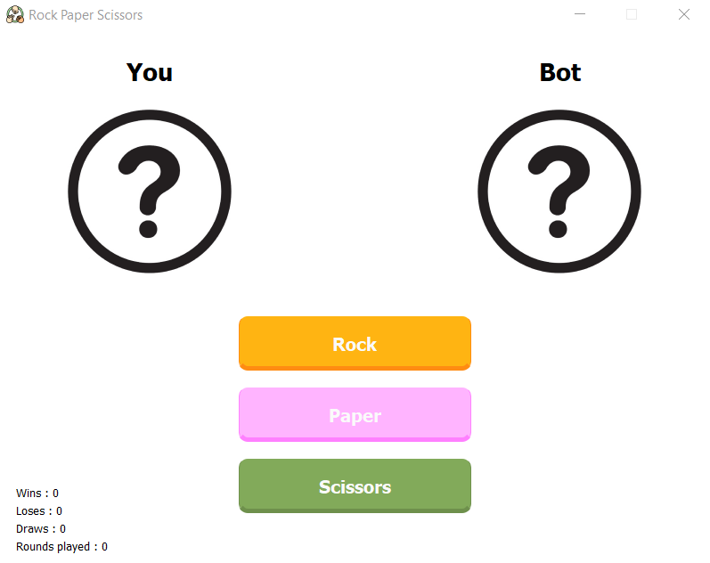
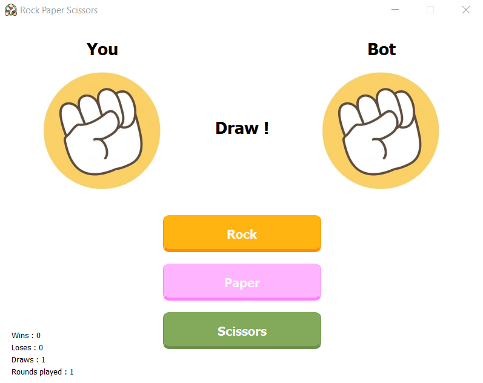
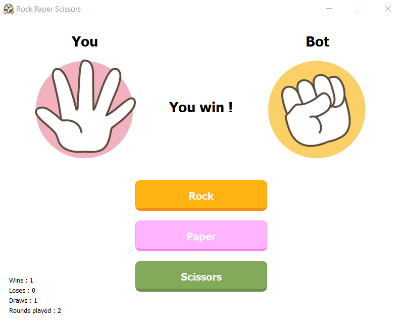
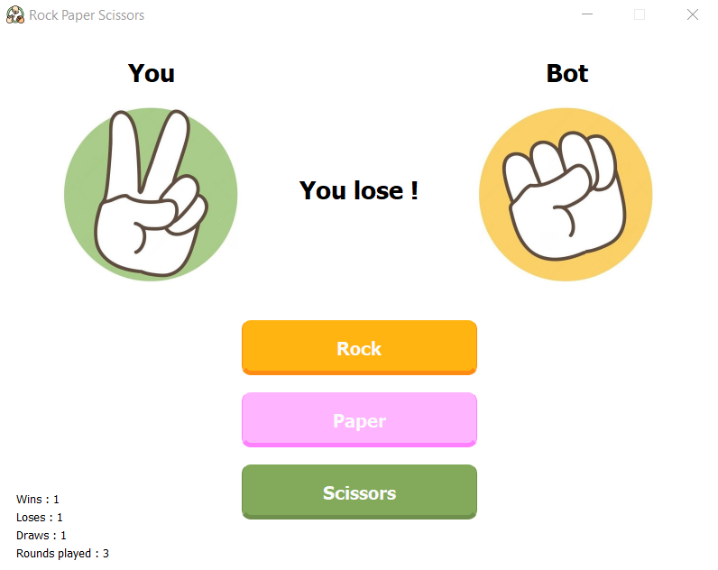

# Rock-Paper-Scissor-Qt-GUI

## Description
Hello everyone, welcome to this "rock, paper, scissors" game, the main reason why i did this project was to learn about the Qt framework and C++ and wanted to create a GUI application for this game, since this game has a pretty simple game logic and i've already done this in C, i think it was a good idea to start with. 
In any case, have fun !
  

## Content
Keep in mind that aside from this README file and the demo_images folder, if you move away one of the data.json or the res folder (containing images for the game) or the code itself, the code will not be able to read them (since the code gets images and data from a relative path ../res/*.png or ../data.json)
  

## References
For the design of buttons, i stumbled upon a video (link down below) and i used the code shown in the video for these nice looking buttons, i simply copied and changed the colors. 
https://www.youtube.com/watch?v=NqaEQT_F-8Q
  

## Authors
Realized by Henrique D.M.M
  

## Demo images
### Choose carefully

### Playing rock, it's a draw !

### Playing paper, you win !

### Playing rock, you lose !

### NOTE : I promise the bot can play anything than just rock

